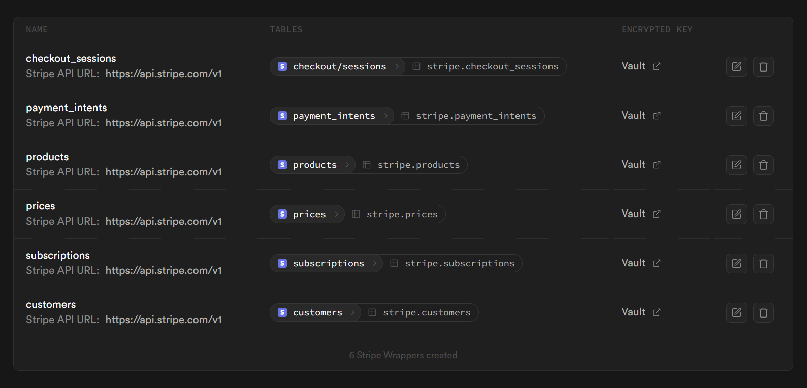

# NgxSupabaseStripe

An Angular library for integrating Supabase and Stripe into your applications, providing ready-to-use components that simplify the implementation of payments and subscriptions.

## Features

- 💳 **Payment Processing** - Components to manage one-time payments through Stripe Checkout
- 📅 **Subscription Management** - Complete support for Stripe recurring subscriptions
- 🛒 **Product Listing** - Component to display Stripe products with their prices
- 👤 **Customer Management** - Components to display customer information, payment history, and subscriptions
- 🔒 **Supabase Integration** - Automatic synchronization between Stripe and the Supabase database
- 📊 **Reactive State** - State management using Angular/NgRx signals
- 📱 **Responsive** - Components designed to work perfectly on mobile and desktop devices
- 🎨 **Highly Customizable** - Ability to adapt the style and behavior of components

## Installation

### Step 1: Install the package

```bash
npm install ngx-supabase-stripe
```

### Step 2: Configuration in app.config.ts

```typescript
import { ApplicationConfig } from '@angular/core';
import { provideHttpClient } from '@angular/common/http';
import { provideNgxSupabaseStripe } from 'ngx-supabase-stripe';

export const appConfig: ApplicationConfig = {
  providers: [
    provideHttpClient(),
    provideNgxSupabaseStripe({
      supabase: {
        url: 'YOUR_SUPABASE_URL',
        key: 'YOUR_SUPABASE_ANON_KEY',
      },
      stripe: {
        publicKey: 'YOUR_STRIPE_PUBLIC_KEY',
      }
    })
  ]
};
```

### Step 3: Supabase Foreign Tables and Public Supabase Functions Setup

To properly integrate Stripe with Supabase, you need to set up foreign tables through the Stripe wrapper extension and create several public functions in Supabase's SQL editor to access Stripe data.

#### Install Stripe Wrapper Extension

First, you need to install the Stripe API wrapper extension in your Supabase project:

1. Go to the Supabase Dashboard
2. Navigate to your project's Database section 
3. Select "Integrations" and add Stripe Wrapper 
4. Install the next Stripe Wrappers. This step will create the following tables:



#### Create Public Functions

Create the following public functions that the library uses to access Stripe data. We need to create these functions in the `public` schema:

```sql
-- Get customer by email
create or replace function public.get_stripe_customer(customer_email text)
returns table (
  id text,
  email text,
  name text,
  description text,
  created timestamp,
  attrs jsonb
)
language plpgsql
security definer set search_path = ''
as $$
begin
  return query
  select 
    c.id,
    c.email,
    c.name,
    c.description,
    c.created,
    c.attrs
  from stripe.customers c
  where c.email = customer_email;
end;
$$;

-- Get customer payment intents
create or replace function public.get_stripe_customer_payment_intents(customer_id text)
returns table (
  id text,
  customer text,
  amount bigint,
  currency text,
  payment_method text,
  created timestamp,
  attrs jsonb
)
language plpgsql
security definer set search_path = ''
as $$
begin
  return query
  select 
    p.id,
    p.customer,
    p.amount,
    p.currency,
    p.payment_method,
    p.created,
    p.attrs
  from stripe.payment_intents p
  where p.customer = customer_id;
end;
$$;

-- Get customer subscriptions
create or replace function public.get_stripe_customer_subscriptions(customer_id text)
returns table (
  id text,
  customer text,
  currency text,
  current_period_start timestamp,
  current_period_end timestamp,
  attrs jsonb
)
language plpgsql
security definer set search_path = ''
as $$
begin
  return query
  select 
    s.id,
    s.customer,
    s.currency,
    s.current_period_start,
    s.current_period_end,
    s.attrs
  from stripe.subscriptions s
  where s.customer = customer_id;
end;
$$;

-- Get stripe prices
create or replace function public.get_stripe_prices()
returns table (
  id text,
  active boolean,
  currency text,
  product text,
  unit_amount bigint,
  type text,
  attrs jsonb  -- Añade el campo attrs
)
language plpgsql
security definer set search_path = ''
as $$
begin
  return query
  select
    t.id,
    t.active,
    t.currency,
    t.product,
    t.unit_amount,
    t.type,
    t.attrs
  from
    stripe.prices t;
end;
$$;

-- Get stripe product by id
create or replace function public.get_stripe_product(product_id text)
returns table (
  id text,
  name text,
  active boolean,
  default_price text,
  description text,
  attrs jsonb  -- Añade el campo attrs
)
language plpgsql
security definer set search_path = ''
as $$
begin
  return query
  select
    t.id,
    t.name,
    t.active,
    t.default_price,
    t.description,
    t.attrs  -- Incluye el campo attrs en la consulta
  from
    stripe.products t
  where
    t.id = product_id;
END;
$$;

-- Get stripe products
CREATE OR REPLACE FUNCTION public.get_stripe_products()
RETURNS TABLE (
  id text,
  name text,
  active boolean,
  default_price text,
  description text,
  attrs jsonb  -- Añade el campo attrs
)
LANGUAGE plpgsql
SECURITY DEFINER SET search_path = ''
AS $$
BEGIN
  RETURN QUERY
  SELECT
    t.id,
    t.name,
    t.active,
    t.default_price,
    t.description,
    t.attrs  -- Incluye el campo attrs en la consulta
  FROM
    stripe.products t;
END;
$$;

-- Get stripe subscriptions
create or replace function public.get_stripe_subscriptions()
returns table (
  id text,
  customer text,
  currency text,
  current_period_start timestamp,
  current_period_end timestamp,
  attrs jsonb
)
language plpgsql
security definer set search_path = ''
as $$
begin
  return query
  select 
    s.id,
    s.customer,
    s.currency,
    s.current_period_start,
    s.current_period_end,
    s.attrs
  from stripe.subscriptions s;
end;
$$;

-- Get stripe subscription by id
create or replace function public.get_stripe_subscription(subscription_id text)
returns table (
  id text,
  customer text,
  currency text,
  current_period_start timestamp,
  current_period_end timestamp,
  attrs jsonb
)
language plpgsql
security definer set search_path = ''
as $$
begin
  return query
  select 
    s.id,
    s.customer,
    s.currency,
    s.current_period_start,
    s.current_period_end,
    s.attrs
  from stripe.subscriptions s
  where s.id = subscription_id;
end;
$$;
```

## Available Components

### Embedded Checkout (EmbeddedCheckoutComponent)

Allows you to integrate a Stripe payment flow directly into your application:

```typescript
import { EmbeddedCheckoutComponent } from 'ngx-supabase-stripe';

@Component({
  selector: 'app-payment',
  standalone: true,
  imports: [EmbeddedCheckoutComponent],
  template: `
    <lib-embedded-checkout 
      [priceId]="'price_1234567890'"
      [returnPagePath]="'/payment-success'">
    </lib-embedded-checkout>
  `
})
export class PaymentComponent {}
```

**Inputs:**
- `priceId` (required): Stripe price ID to charge
- `returnPagePath` (optional): Path to redirect after payment (default: '/return')

### Embedded Subscription (EmbeddedSubscriptionComponent)

For implementing Stripe recurring subscriptions:

```typescript
import { EmbeddedSubscriptionComponent } from 'ngx-supabase-stripe';

@Component({
  selector: 'app-subscription',
  standalone: true,
  imports: [EmbeddedSubscriptionComponent],
  template: `
    <lib-embedded-subscription 
      [priceId]="'price_1234567890'"
      [returnPagePath]="'/subscription-success'">
    </lib-embedded-subscription>
  `
})
export class SubscriptionComponent {}
```

**Inputs:**
- `priceId` (required): Stripe subscription price ID
- `returnPagePath` (optional): Path to redirect after activating the subscription (default: '/subscription-return')

### Product List (ProductListComponent)

Displays a list of Stripe products with options to select:

```typescript
import { ProductListComponent, StripeProductPublic, StripePricePublic } from 'ngx-supabase-stripe';

@Component({
  selector: 'app-products',
  standalone: true,
  imports: [ProductListComponent],
  template: `
    <lib-product-list 
      [productType]="'recurring'"
      (productSelected)="onProductSelect($event)"
      (priceSelected)="onPriceSelect($event)">
    </lib-product-list>
  `
})
export class ProductsComponent {
  onProductSelect(product: StripeProductPublic) {
    console.log('Product selected:', product);
  }

  onPriceSelect(price: StripePricePublic) {
    console.log('Price selected:', price);
  }
}
```

**Inputs:**
- `productType` (optional): Type of products to display ('one_time' or 'recurring', default: 'one_time')

**Outputs:**
- `productSelected`: Event emitted when a product is selected
- `priceSelected`: Event emitted when a price is selected

### Subscriptions List (SubscriptionsListComponent)

Displays the customer's active subscriptions:

```typescript
import { SubscriptionsListComponent } from 'ngx-supabase-stripe';

@Component({
  selector: 'app-my-subscriptions',
  standalone: true,
  imports: [SubscriptionsListComponent],
  template: `
    <lib-subscriptions-list></lib-subscriptions-list>
  `
})
export class MySubscriptionsComponent {}
```

### Customer Component (CustomerComponent)

Complete page with customer information, payment history, and subscriptions:

```typescript
import { CustomerComponent } from 'ngx-supabase-stripe';

@Component({
  selector: 'app-customer-page',
  standalone: true,
  imports: [CustomerComponent],
  template: `
    <lib-customer></lib-customer>
  `
})
export class CustomerPageComponent {}
```

## State Management

The library uses NgRx Signals for reactive state management. You can inject stores into your components:

```typescript
import { Component, inject } from '@angular/core';
import { ProductsStore, CheckoutStore, SubscriptionsStore, CustomerStore } from 'ngx-supabase-stripe';

@Component({
  // ...
})
export class MyComponent {
  private productsStore = inject(ProductsStore);
  private checkoutStore = inject(CheckoutStore);
  private subscriptionsStore = inject(SubscriptionsStore);
  private customerStore = inject(CustomerStore);

  // Access state
  products = this.productsStore.products();
  checkoutSession = this.checkoutStore.session();
  subscriptions = this.subscriptionsStore.subscriptions();
  customer = this.customerStore.customer();
}
```

## More Information

For more details on how to use the library, check out the examples in [the GitHub repository](https://github.com/yourusername/ngx-supabase-stripe).
